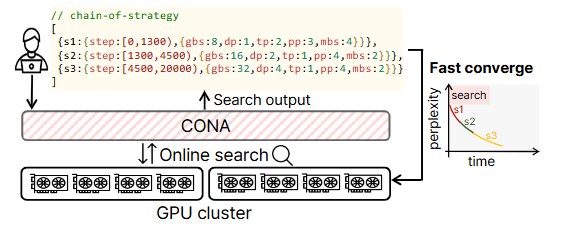
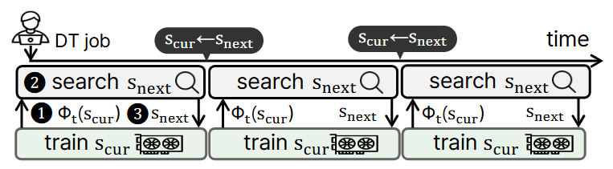

# CONA: Parallelism Strategy Chaining for Fast Training Convergence

CONA trains large language models under a sequence of parallelism strategies
rather than a single fixed one. It monitors throughput and gradient statistics
online and switches the current strategy `(dp, tp, pp, mbs, gbs)` whenever the
switch is expected to reduce time-to-perplexity.



## Requirements

* Python 3.10
* PyTorch 2.4.1
* CUDA 12.4
* NCCL 2.20.5
* NVIDIA driver 550.67

Example setup:

```bash
pip install deepspeed botorch gpytorch
python3 -m pip install --no-cache-dir -e /workspace/utils/adaptdl/adaptdl
```

## Dataset

Datasets should be preprocessed into the indexed dataset format supported by Megatron-DeepSpeed.

Example preprocessing:

```bash
cd /workspace/Megatron-DeepSpeed

python tools/preprocess_data.py \
  --input <input.jsonl> \
  --output-prefix <output_prefix> \
  --vocab-file <vocab.json> \
  --merge-file <merges.txt> \
  --tokenizer-type GPT2BPETokenizer \
  --dataset-impl mmap \
  --append-eod \
  --workers <N>
```

Adjust the dataset paths and preprocessing options as needed for your setup.

## Configure: `.conaconfig`

CONA requires a `.conaconfig` file for model, training, dataset, tokenizer, and output settings.

Create `cona/gpt/.conaconfig` and adjust the configuration for your environment. The runner and planner locate `.conaconfig` in the current directory or a parent directory; use `--config PATH` to specify a different location.

The file contains two main sections: `model` for model-related settings and `training` for training, optimization, dataset, tokenizer, logging, and runtime settings.

A simplified configuration example is shown below:

```json
{
  "model": {
    "name": "<model_name>",
    "layers": "<num_layers>",
    "hidden": "<hidden_size>",
    "ffn_hidden": "<ffn_hidden_size>",
    "heads": "<num_attention_heads>",
    "seq": "<sequence_length>"
  },
  "training": {
    "zero_stage": "<zero_stage>",
    "dtype": "<precision>",
    "base_gbs": "<global_batch_size>",
    "base_lr": "<learning_rate>",
    "base_min_lr": "<minimum_learning_rate>",
    "lr_scale_strategy": "<lr_scale_strategy>",
    "lr_decay_tokens": "<lr_decay_tokens>",
    "lr_warmup_tokens": "<lr_warmup_tokens>",
    "weight_decay": "<weight_decay>",
    "split": "<dataset_split>",
    "data_prefix": "<dataset_prefix>",
    "vocab_file": "<vocab_file>",
    "merge_file": "<merge_file>",
    "tokenizer_type": "<tokenizer_type>",
    "data_cache_path": "<data_cache_path>",
    "log_root": "<log_directory>",
    "wandb_project": "<wandb_project>",
    "wandb_dir": "<wandb_directory>",
    "wandb_mode": "<wandb_mode>"
  }
}
```

### `model`

| Key                                   | Meaning                                                         |
| ------------------------------------- | --------------------------------------------------------------- |
| `name`                                | Model identifier used for organizing checkpoints                |
| `layers`, `hidden`, `heads`           | Transformer depth, hidden size, and number of attention heads   |
| `ffn_hidden`                          | Feed-forward hidden size; defaults to `4 * hidden` when omitted |
| `seq`                                 | Sequence length and maximum position embedding                  |
| `attention_dropout`, `hidden_dropout` | Dropout settings                                                |
| `normalization`, `layernorm_epsilon`  | Normalization type and epsilon                                  |

Example configurations are provided under `cona/gpt`. Download the model you want to train. This repository uses the default GPT model provided by Megatron-DeepSpeed as an example.

For other models such as BERT-Large or Llama-3.2-1B, model-specific settings can be adjusted through `.conaconfig` and the corresponding backend configuration.

**Note:** The bundled `Megatron-DeepSpeed` is based on [Megatron-LM](https://github.com/NVIDIA/Megatron-LM). Depending on the model and environment, additional configuration or compatibility adjustments (e.g. rebase) may be required.

### `training`

| Key                                                                           | Meaning                                                                               |
| ----------------------------------------------------------------------------- | ------------------------------------------------------------------------------------- |
| `zero_stage`, `dtype`                                                         | DeepSpeed ZeRO stage and numerical precision (`fp16` / `bf16`)                        |
| `base_gbs`, `base_lr`, `base_min_lr`                                          | Reference global batch size and learning-rate settings                                |
| `scale_min_lr`                                                                | Whether the minimum learning rate is scaled                                           |
| `lr_scale_strategy`                                                           | Learning-rate scaling strategy: `linear`, `sqrt`, `adascale`, `power`, or `piecewise` |
| `lr_scale_lr_cap`                                                             | Optional upper bound for the scaled learning rate                                     |
| `lr_scale_exp`, `lr_scale_pivot_gbs`, `lr_scale_low_exp`, `lr_scale_high_exp` | Parameters used by the `power` and `piecewise` scaling strategies                     |
| `fallback`                                                                    | Enables or disables the fallback behavior based on GNS changes                        |
| `fallback_ema_alpha`, `fallback_patience`                                     | Parameters controlling GNS smoothing and fallback behavior                            |
| `lr_decay_tokens`, `lr_warmup_frac`, `lr_warmup_tokens`                       | Token-based decay; warmup spans `lr_warmup_frac` of the training iterations (default 1%), or a fixed token count when `lr_warmup_tokens` is set |
| `weight_decay`                                                                | AdamW weight decay                                                                    |
| `split`                                                                       | Dataset split configuration                                                           |
| `data_prefix`                                                                 | Indexed dataset path                                                                  |
| `vocab_file`, `merge_file`, `tokenizer_type`                                  | Tokenizer configuration                                                               |
| `data_cache_path`                                                             | Dataset cache path                                                                    |
| `log_interval`, `eval_interval`, `eval_iters`                                 | Logging and evaluation settings                                                       |
| `distributed_timeout_minutes`                                                 | Distributed runtime timeout                                                           |
| `log_root`                                                                    | Log directory                                                                         |
| `wandb_project`, `wandb_dir`, `wandb_mode`                                    | Weights & Biases settings                                                             |


## Checkpoints

Checkpoints go to

```text
checkpoints/<model.name>/z<zero_stage>/<dtype>/tp<tp>_pp<pp>_dp<dp>_sp1
```

Each strategy has its own directory, because the shard layout differs. At every
switch the runner converts the just-saved checkpoint to DeepSpeed Universal
format alongside it as `global_step<N>_universal`, writes a `latest_universal`
marker, and the next stage loads through that — which is what lets a run resume
under a different `(dp, tp, pp)`.

Universal copies are large, so a chain can prune them as it goes. Each entry
under `pruning` in a chain config names a stage to prune after, a `ckpt_dir`
that must match the layout above, and a mode: `keep-latest` keeps only the
directory `latest_universal` points at, `delete-all` removes all of them.

## Run

### Testing strategy chains

`--chain FILE` runs a predefined strategy sequence, while `--dp/--tp/--pp/--gbs/--mbs` fixes a single strategy for the entire run. Both options can be used to test training, checkpoint conversion, strategy switching, and pruning independently of the online search.

```bash
cd /workspace/cona/gpt

# a sequence of strategies, converting and switching between them
python run_training.py --chain chain_config_test_200iters.json \
  --workdir /workspace/cona --repo-path /workspace/Megatron-DeepSpeed

# one strategy, held fixed
python run_training.py --dp 4 --tp 1 --pp 1 --gbs 16 --mbs 4 --iters 1000 \
  --workdir /workspace/cona --repo-path /workspace/Megatron-DeepSpeed
```

`chain_config_test_200iters.json` is a three-stage chain on four GPUs, 200
iterations per stage. It starts at `dp2/tp1/pp2` and `gbs` 8, switches to
`dp4/tp1/pp1` at `gbs` 16, then climbs to `gbs` 32 — so one run of 600
iterations covers a `(dp, pp)` change, two `gbs` changes, two conversions, and
both pruning modes. `chain_config.json` is the full-length version of the same
shape.

A chain config lists `steps`, each naming a strategy and how long to train
under it:

| Key | Meaning |
|---|---|
| `step_num` | Numbers the stage in logs and derives its master port; stages count 1, 2, 3, … and the conversion after a stage carries that stage's number |
| `dp`, `tp`, `pp`, `gbs`, `mbs` | The strategy for this stage; `dp * tp * pp` must equal the GPU count |
| `train_iters`, `extra_iters`, `target_iters` | How long to train, as an absolute horizon, a count added to the iteration the checkpoint reached, or an iteration to stop at. Exactly one is required |
| `is_initial` | Marks the first stage, which starts from scratch rather than loading a checkpoint |
| `load_dp`, `load_tp`, `load_pp` | The layout the previous stage saved under, when it differs from this one |
| `convert` | Whether to convert this stage's checkpoint to Universal format afterwards; the final stage does not need it |

`pruning` entries delete the Universal copies a stage leaves behind, as
described under [Checkpoints](#checkpoints).


### Single node

```bash
cd /workspace/cona/gpt
python run_training.py \
  --gpus 4 --system a100_80g_2gpu_node \
  --initial-gbs 8 --max-gbs 256 --total-iters 10000 \
  --workdir /workspace/cona \
  --repo-path /workspace/Megatron-DeepSpeed
```

That trains with the strategy search running beside it, switching whenever the
search finds a strategy that reaches the target perplexity sooner.

### Multi-node

Nodes must share the workspace over NFS. Run this on every node, changing only
`--node-rank`:

```bash
python run_training.py \
  --chain chain_config_multinode_12gpu.json \
  --workdir /workspace/cona \
  --repo-path /workspace/Megatron-DeepSpeed \
  --num-nodes 3 --gpus-per-node 4 \
  --hostfile /workspace/hostfile_3nodes \
  --master-addr 10.10.10.22 \
  --no-ssh --node-rank <0|1|2>
```

`--hostfile` is a DeepSpeed launcher hostfile that lists the nodes, one per line:

Example:

```
1.2.3.4 slots=4
1.2.3.5 slots=4
1.2.3.6 slots=4
```

`slots` is the node's GPU count and must match `--gpus-per-node`. Keep the file
on the shared mount and pass one of its addresses as `--master-addr`. With
`--no-ssh` each node is launched by hand and the file only defines the topology;
without it, rank 0 starts the other nodes over SSH.

Every stage requires `dp * tp * pp == num_nodes * gpus_per_node`, and every node
must be started for every stage. Rank 0 converts the checkpoint once the NFS
barrier confirms all nodes have exited training.

## Strategy search



During training, CONA searches for the next strategy on the CPU using the
gradient noise scale reported by the training loop. When CONA determines that
a strategy switch is beneficial, the current run saves a checkpoint and stops.
Training then resumes from the corresponding checkpoint under the selected
strategy. For details on how CONA decides when and where to switch, please refer
to the paper.

CONA uses Bayesian optimization (BO) together with
[Calculon](https://github.com/calculon-ai/calculon) to search for the next
strategy without additional GPU profiling. The BO settings are controlled by
`BOOTSTRAP_SAMPLES`, `EI_STOP_FRACTION`, and `MAX_GP_UPDATES` in
`cona/gpt/strategy_search.py`. With `--no-botorch`, each frontier is evaluated
exhaustively instead. `plan_chain.py` runs the same search procedure offline
using a recorded trace.

## License

CONA-specific code is released for research and reproduction. Three
third-party components are included under their own licenses —
[Megatron-DeepSpeed](https://github.com/microsoft/Megatron-DeepSpeed) as the
training framework, [AdaptDL](https://github.com/petuum/adaptdl) for
gradient-noise-scale monitoring, and
[Calculon](https://github.com/calculon-ai/calculon) for analytical iteration
time. The first two carry CONA modifications.

## Citation

Please consider citing our EMNLP’26 paper if you find CONA to be related to your research project.

```bibtex
@inproceedings{cona-emnlp26,
  author={Kang, Minchul and Shin, Changyong and Go, Younghun and Lee, Hyunho and Jeong, Jinwoo and Yoo, Chuck and Yang, Gyeongsik},
  title={Parallelism Strategy Chaining for Fast Training Convergence},
  booktitle={Proceedings of the 2026 Conference on Empirical Methods in Natural Language Processing (EMNLP)},
  year={2026},
}
```
